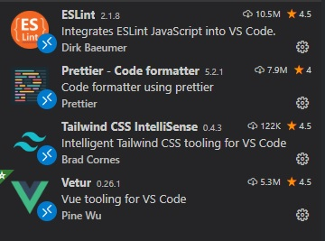

# The HPS Blog


A simple blog made with NestJS and Vue in typescript for internal school use.

## Features
* HTML wysiwyg post editing with image upload
* Attachments / file upload to S3 or any cloud host with an S3-compatible API such as DigitalOcean (or store locally)
* Role based access with 5 levels
* Login based on Google OAuth or SAML, so with a few tweaks it can be used as a general purpose blog for any organisation
* Verification system for posts
* Comments with single chain replies
* Dark mode!
* Progressive web app support

## Project Overview
### Backend 

[NestJS](https://github.com/nestjs/nest) with [Objection.js](https://github.com/Vincit/objection.js/)

Database - Postgres

### Frontend

[Vue 2](https://github.com/vuejs/vue) + [Composition API](https://composition-api.vuejs.org/#summary) with typescript (plans to move to Vue 3 on release)

[Tailwind](https://github.com/tailwindlabs/tailwindcss) for styles

[Quill](https://github.com/quilljs/quill) rich text editor

## Quick start
Node.js and Postgres need to be installed. After pulling the repo create a .env file in /server and add the connection details of the database, Google OAuth credentials and optionally the credentials for AWS (refer to .env.example)

To get the server running, run:

```
cd schoolBlog
cd client
npm install
npm run build
cd ../server
npm install
npm run start:dev
```

## Detailed setup
Install [Node.js](https://nodejs.org/en/), and [PostgreSQL](https://www.postgresql.org/). Create a new database in postgres and make sure postgres is running by connecting to it using pgAdmin.
Also make sure [git](https://git-scm.com/) is installed.

### Cloning the repo

Open the terminal and go to the directory where you want to store the project. Clone it by running the following command:
```
git clone https://github.com/udbhav-s/schoolBlog
```
This should download all the necessary project files in a new folder.

Next, create a file named `.env` in the server subdirectory. This file houses all the necessary configuration parameters needed to get the project up and running, mainly the location and credentials for the database, AWS keys to access cloud storage, and the google oauth client details to manage login. Copy and paste all the required params from `.env.example` in the same folder.

### Database connection details
Since we're using a local database for testing, the `DATABASE_HOST` parameter will be `localhost`. The database username is usually `postgres` by default if you didn't specify anything else during the setup, and set `DATABASE_NAME` to the name of the database you created for the project.

### File storage
If you want to store the files locally for testing, set `STORAGE` to `local` and specify an absolute path on the system for `UPLOADS_PATH`. If you want to store files in an S3 bucket (or another service with a compatible API), set `STORAGE` to `s3` and add your AWS credentials and the bucket name.

### OAuth
There are two possible methods for authentication and logging in, OAuth and SAML, although SAML is currently disabled in the code and can be uncommented to make it work.
Follow [this guide](https://support.google.com/googleapi/answer/6158849?hl=en) to obtain credentials for Google OAuth and add them to the `.env` file.

### Editor
This example will be using [VS Code](https://code.visualstudio.com/) as the editor. After downloading and installing it, create a new workspace and add the `client` and `server` folders (in that order) to the workspaces using the add folder to workspace option. This makes sure all the extensions work properly. 
Go to the extensions tab and install these extensions:



### Running the development servers
Run the database migrations to populate the database with the project's tables:
```
cd server
npm run migrate
```
#### Frontend
```
cd client
npm install
npm run serve
```
#### Backend
```
cd server
npm install
npm run start:dev
```

## Running in production
For production, using an [Nginx](https://www.nginx.com/resources/wiki/) server with https support and gzip enabled for serving static assets is recommended, along with [pm2](https://pm2.keymetrics.io/docs/usage/quick-start/) for managing the node server.
